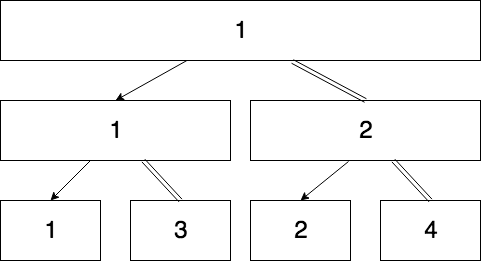

# EECS-338-Final-Project

## Summary of Files

### Makefile

The makefile is responsible for compiling all of the files and merging them together. The makefile first compiles all of the c programs into .o files and then stitches them together at the end. The result of a successful make should be a binary file titled run in the root folder of the project.

### mergesort.c

Merge Sort of the list works in such a way that every time the algorithm splits the list, it creates a new child process to sort the second half of the split list while the parent finishes sorting the first half. For a better depiction, see the diagram below:

This method will allow thread reuse while also ensuring that there is a maximal cover of threads for each part of the list. At the end of each sorting cycle, the parent will wait for the child thread to terminate and will merge the two parts of the sorted list back together.

##### Summary of Functions

`int[] mergesort(int arr[], long threads, long size)`

This function will mergesort the list using the function `mergesort_helper`. This function is a wrapper funciton based designed to sort the entire array. A long is passed for the threads and size arguments to avoid segmentation faults. 

`void *mergesort_helper(void *arguments)`

This function will be called by each child thread and will be responsible for splitting each half and then merging the two halves together using `merge`. The `mergesort_helper` function will see if it can instantiate a new thread, if it can it will add the thread to the array of threads and call `mergesort_helper` on the first part of the list while the child thread sorts the other.

`void merge(int *arr, long start, long middle, long stop)`

The merge function merges the lists from first to second, and then from second to stop. The merge function assumes that both lists are already sorted, and goes through each part of the list comparing the least significant elements until it has completed merging the list. The resulting list should then be sorted. Longs are passed for the 2nd, 3rd, and 4th arguments to avoid segmentation faults.

`int *randomArray (long size)`

Method used to create an array of size `size` filled with random values between 0 and 2147483647. This method is used for testing.

##### Summary of Data Types

Since the function operates separately on different parts of the array, semaphores are unnecessary. Instead, we will be using an array of pthread tid's and an array of pthread attribute structs to operate on separate parts of the array.

The threads themselves will be allocated in such a way that no two threads will be able to operate on the same elements of the list at a time, to ensure that the entire operation is thread safe. Any global variables used in the merge sort methods (save the array) will be wrapped in a semaphore to ensure that the entire process is thread safe.

The only additional data type will be the struct used to pass information from the functions to the `mergesort_helper` function. This struct will include the start and end values of the array to be sorted, and will enable child processes to know which area of the list to sort.

##### Sample Output

1,1,0.000202
1,2,0.000161
1,4,0.000151
1,8,0.000159
1,16,0.000160
1,32,0.000152
1,64,0.000148
1,128,0.000059
1,256,0.000087
1,512,0.000125
1,1024,0.000265
1,2048,0.000450
1,4096,0.000656
1,8192,0.001443
1,16384,0.002779

### bubblesort.c

This algorithm acts as a modified version of bubblesort. Instead of having one bubble move up the list continuously, this function will have multiple threads that do comparisons and swapping at once. These individual 'bubbles' will move up the list one after another, and will be cycled back to the beginning once they reach the end of the list.

This algorithm has several advantages over traditional bubble sort, since the algorithm runs multiple bubbles at once, it should divide the work needed to be done by the algorithm by a factor of the number of active threads.

Due to limited space on the list, however, the maximum number of threads which can be in use at one time is the number of elements in the list divided by two.

##### Summary of functions

`int[] bubblesort (int *arr, int threads, int size)`

This function will be a wrapper function which will allow the bubble sort method to be called quickly and easily from the main script. This function will also be responsible for calculating the thread requirements for each list and instantiating that many threads.

`void *bubble (void *args)`

This function will be run by each individual thread. The bubble function will be responsible for comparing and swapping values, as well as waiting until all threads have completed before incrementing its thread's position in the list.

`void swap (int *arr, int i, int j)`

This function's sole responsibility is to swap the values at index1 and index2 in the array. Using these three functions, we can implement a version of bubblesort which uses multiple threads to decrease the amount of work that needs to be done.

`int *randomArray (long size)`

Method used to create an array of size `size` filled with random values between 0 and 2147483647. This method is used for testing.

`int main (int argc, char* argv[])`

Method used to test various values of NUM_THREADS and array size. Will test threads between 1 and 128 and increments by threads * 2. Will test array sizes between 1 and 20000 and increments by size *2. 

##### Summary of Data Types

To prevent two of the bubbles from colliding with each other, there will be a global flag which notifies each bubble when to increment value and swap. This will keep the bubbles from attempting to modify the same values at a time, and should yield faster results than other solutions such as maintaining a list of all bubble positions. This allows each bubble to increment itself, instead of incrementing the position of each bubble separately.

There will also be a global count which will show how many active threads have been completed. This variable will be the trigger for each of the active threads to increment once it reaches the total number of threads. This variable must be controlled by a semaphore.

The program must also contain a flag which notifies the program once the list has been sorted. This flag will either be 0 or 1, and will change value after a thread reaches the end of the function without having to perform any swaps.

Since we are incrementing each thread's position at the same time, we do not need to surround each element with semaphores, as the threads will be kept from ever interacting with the same values at the same time. This will allow us to keep the memory cost of this implementation low, while also maintaining its thread safety.

##### Sample Output

1,1,0.000000
1,2,0.000001
1,4,0.005199
1,8,0.000293
1,16,0.001427
1,32,0.002988
1,64,0.012255
1,128,0.052896
1,256,0.203736
1,512,0.889829
1,1024,3.605456

### quicksort.c

Quick sort of the list works in a way such that after every partition is created, a new child thread will be created that will take the second part of the patitioned list. After the list is split, the parent will work on their half while the child works on theirs. The list will continue splitting until either the list is sorted, or the maximum number of usable threads is reached. Once any section of the list is sorted, the parent will wait for the child. This will cascade until the entire list is completely sorted.

##### Summary of functions

`int[] quicksort(int arr[], int threads, int size)`

This function will be a wrapper class designed to be called in the main.c file.

`void swap(int list[], int index1, int index2)`

The swap function of the "quicksort.c" file can take an array "list[]", and two indexes; "index1", and "index2". This method will then modify the "list[]" variable in such a way that the element at "index1" swaps with the element at "index2" of the list.

`void partition(int arr[], int partitionIndex)`

The partition function of the "quicksort.c" file can take an array "arr[]" and a partition index. The list will then partition at the index, sending one of of the array to be sorted by the parent thread recursively, and the other half of the array to be sorted recursively by the child. This will continue until either the maximum number of the threads are reached, or a section of the list is sorted. The parent will wait for its child, and this will cascade until the list is completley sorted.

 `int quicksort_setup(int list[], int maxThreads)`

 This method of the "quicksort.c" file is used to ensure that the maximum number of threads are not in use.
 
 `int *randomArray (long size)`

Method used to create an array of size `size` filled with random values between 0 and 2147483647. This method is used for testing.

##### Summary of Data Types

Similarly to Merge Sort, since the function will operate on seperate sections of the array, semaphores are unecessary here. Additionally, Quick Sort uses an array of pthreads with different tid's and and an array of different attributes. 

However, there will be a semaphore used to protect any global variables that may be used during the process. 

The only data type that we created for this file is the struct `params` that will be used to hold the array of tids, attributes, and various other values. 

##### Sample Output

1,1,0.000246
1,2,0.000162
1,4,0.000137
1,8,0.000107
1,16,0.000125
1,32,0.000101
1,64,0.000069
1,128,0.000084
1,256,0.000092
1,512,0.000188
1,1024,0.000206
1,2048,0.000297
1,4096,0.000593
1,8192,0.001565
1,16384,0.002851
1,32768,0.006150
1,65536,0.014101
1,131072,0.029801
1,262144,0.057098
1,524288,0.112673

### mergesort_single_process.c

This file contains the classic mergesort algorithm for that is run with a single process. We are using it to compare to the multiprocess sorting algorithms we created as a sort of control in the experiment that will be conducted in `main.c`.

##### Summary of functions

`void sort(int array[], int temp[], long low, long high)`

This function contained in `mergesort_single_process.c` is used as the main call to sort an array in ascending order using the classic mergesort algorithm. The way it works is by repeatedly calling the sort function recursively, and the merge function that will be discussed following this. The sort function will split the array in half as evenly as possible repeatably. Array and Temp is passed in order to get the place in memory from the `main()` method to the `merge()` method. Longs are passed to avoid segmentation faults.

`void merge(int array[], int temp[], long low, long mid, long high)`

This function of the `mergesort_single_process.c` file merges the array back together after it has been split based off which value is larger. It does this by utilizing the array `temp[]` to store the values of `array[]` in the desired order. At the end of the algorithm, the updated values in `temp[]` are placed in `array[]`, and `temp[]` is emptied to ensure no overflow errors. Longs are passed to avoid segmentation faults.

`int *randomArray (long size)`

Method used to create an array of size `size` filled with random values between 0 and 2147483647. This method is used for testing.

`int main()`

Method utilized to print the times it takes to sort the array at increments i = i * 2, up to 1000000. The times will be compared to our multi-threaded algorithm.

##### Summary of Data Types

Two arrays are utilized in this file, `temp[]` and `array[]`. `array[]` contains the values that is to be sorted, and is updated by the values within `temp[]` at every merge call. The reason this was implemented like this was to ensure that memory would not overflow in the tests where we utilizes arrays of size 500000000. We wanted a single `temp[]` that was written and overwritten continuously in order to ensure this error would be avoided, and also it would allow for O(N) runtime.

##### Sample Output

N = 1, Time = 0.000000
N = 2, Time = 0.000001
N = 4, Time = 0.000000
N = 8, Time = 0.000002
N = 16, Time = 0.000002
N = 32, Time = 0.000005
N = 64, Time = 0.000009
N = 128, Time = 0.000018
N = 256, Time = 0.000035
N = 512, Time = 0.000076
N = 1024, Time = 0.000161
N = 2048, Time = 0.000353
N = 4096, Time = 0.000757
N = 8192, Time = 0.001618
N = 16384, Time = 0.003440
N = 32768, Time = 0.007403
N = 65536, Time = 0.015791
N = 131072, Time = 0.044796
N = 262144, Time = 0.129047
N = 524288, Time = 0.270556
N = 1048576, Time = 0.485138

### bubblesort_single_process.c

This is the classic bubblesort algorithm for a single process. We are using it to compare to the multiprocess sorting algorithms we created as a sort of control in the experiment that will be conducted in `main.c`.

##### Summary of functions

`bubblesort(int array[], long index)`

This method of the `mergesort_single_process.c` file will sort a list of values in an ascending order. It does this by looking through the list of values linearly, and at each increment it will compare the index value to the next sequential value. It will swap the values and continue searching the list linearly until the list is sorted. A long is passed to avoid segmentation faults.

`swap(int *arr, long index1, long index2)`

This method of the `mergesort_single_process.c` file is a helper method for the `bubblesort(int array[], long index)` method. It is used to swap the value of index1, and index2. Utilized primarily to make the code more readable, longs are passed to avoid segmentation faults.

`int *randomArray (long size)`

Method used to create an array of size `size` filled with random values between 0 and 2147483647. This method is used for testing.

`int main()`

Method utilized to print the times it takes to sort the array at increments i = i * 2, up to 20000. The times will be compared to our multi-threaded algorithm.

##### Summary of Data Types

This function operates on only a single array. Since it is a single process function, no variables are necessary to be protected.

##### Sample Output

N = 1, Time = 0.000001
N = 2, Time = 0.000002
N = 4, Time = 0.000002
N = 8, Time = 0.000003
N = 16, Time = 0.000006
N = 32, Time = 0.000016
N = 64, Time = 0.000049
N = 128, Time = 0.000175
N = 256, Time = 0.000618
N = 512, Time = 0.002272
N = 1024, Time = 0.008868
N = 2048, Time = 0.036607
N = 4096, Time = 0.117366
N = 8192, Time = 0.478801
N = 16384, Time = 2.027349

### quicksort_single_process.c

This is the classic bubblesort algorithm for a single process. We are using it to compare to the multiprocess sorting algorithms we created as a sort of control in the experiment that will be conducted in `main.c`.

##### Summary of functions

`void quicksort(int array[], long lowIndex, long highIndex)`

This function of `quicksort_single_process.c` is the classic quicksort algorithm for a single process. Recursively calls itself and splits the array in half at a partition index. Takes an `array[]` and sorts the array ascending. Longs are used for lowIndex and highIndex in order to avoid segmentation faults.

`int partition(int array[], long lowIndex, long highIndex)`

This function of `quicksort_single_process.c` determines the partition index to be utilized in the `void quicksort(int array[], long lowIndex, long highIndex)` function. Longs are passed in order to avoid segmentation faults.

`int swap(int *arr, long index1, long index2)`

This function is a helper method that swaps two values within an array. Longs are passed to avoid segmentation faults.

`int *randomArray (long size)`

Method used to create an array of size `size` filled with random values between 0 and 2147483647. This method is used for testing.

`int main()`

Method utilized to print the times it takes to sort the array at increments i = i * 2, up to 100000000. The times will be compared to our multi-threaded algorithm.

##### Summary of Data Types

The file `quicksort_single_process.c` contains a single array as its data structure. It will continuously swap values in this array through the functions discussed in the previous section until the array is sorted ascendingly. 

##### Sample Output

N = 1, Time = 0.000000
N = 2, Time = 0.000000
N = 4, Time = 0.000001
N = 8, Time = 0.000002
N = 16, Time = 0.000002
N = 32, Time = 0.000004
N = 64, Time = 0.000007
N = 128, Time = 0.000015
N = 256, Time = 0.000033
N = 512, Time = 0.000066
N = 1024, Time = 0.000147
N = 2048, Time = 0.000316
N = 4096, Time = 0.000705
N = 8192, Time = 0.001547
N = 16384, Time = 0.003381
N = 32768, Time = 0.007348
N = 65536, Time = 0.015470
N = 131072, Time = 0.049027
N = 262144, Time = 0.106824
N = 524288, Time = 0.248797
N = 1048576, Time = 0.442365
N = 2097152, Time = 1.491803

## Work Distribution

#### Noah Houpt

So far on the project I have implemented the bubblesort.c algorithm, the mergesort.c algorithm, and the swap method of quicksort.c. Additionally I have wrote the randomArray() method of the main.c file, and commented on the main.c file. Between this submission and the submission for the final project, I plan on completing the mergesort.c algorithm as well as data analysis of the main.c file's output. I plan to utilize Mathematica as a way to visualize the data if possible. 

#### Guy Marino

I primarily worked on the report for the beta, as I was able to implement the merge and bubble sort sections as well as work on the main section and create all of the images used in the report. I also worked on the quicksort.c file rudimentarily and created the makefile to generate the executable file for this report.

Moving forward, I will bring multithreading into quicksort and bubble sort, as it is not currently supported. I am also going to attempt to make 3D plots of the data in python, if time permits.
